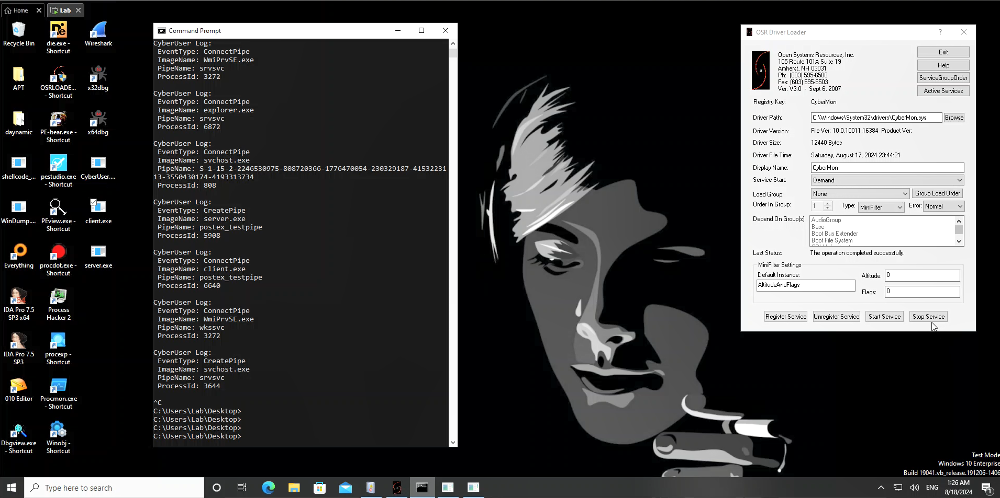
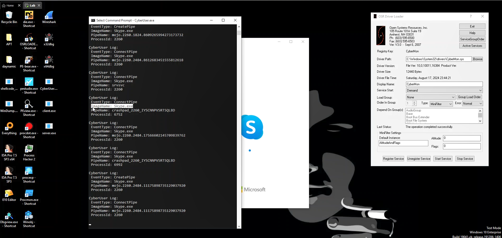

# Windows minifilter driver

* _This repository corresponds to the drive that records the event_:
```
Event ID 17: PipeEvent (Pipe Created)
Event ID 18: PipeEvent (Pipe Connected)

This driver has been tested on Windows 10 operating system.
```

# Images of video parts





# Link video

- [youtube](https://www.youtube.com/watch?v=Zz1yu84jqCU&t=58s)


